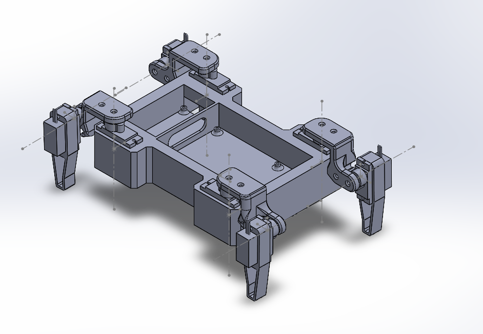
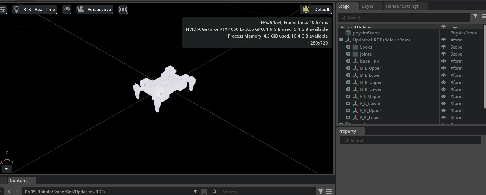

# SpiderBot Training Environment

## Overview

This repository contains the Isaac Lab / Isaac Sim project for the SpiderBot training environment. It includes the environment definition, task configuration, agents, and extension wrapper needed to run training and evaluation in Isaac Lab.

This project is intended to be used as a development starting point for:
- reinforcement learning experiments,
- robot environment configuration,
- training with Isaac Sim / Omniverse,
- embedding custom robot models and reward logic.


### SolidWorks Model



* SolidWorks CAD model of the SpiderBot.*

### URDF Model



* URDF visualization for the robot used in simulation.*

> Replace `path/to/...` with the actual image path or URL for your repository.

## Environment and robot Configuration

The environment configuration is defined in `source/SpiderBotTraining_1/SpiderBotTraining_1/tasks/direct/spiderbottraining_1/spiderbottraining_1_env_cfg.py`the environment implementation is in `source/SpiderBotTraining_1/SpiderBotTraining_1/tasks/direct/spiderbottraining_1/spiderbottraining_1_env.py` and robot configuration is in `source/SpiderBotTraining_1/SpiderBotTraining_1/robot/SpiderBotTraining_1.py`

### Observation Space

The primary observation data includes:
- robot state: joint positions, joint velocities, base pose, and base velocity
- target or goal state: desired position or orientation for the task
- contact and collision information (if enabled)
- any custom sensor readings added for the SpiderBot task

Use the exact observation vector details in the environment class to keep this description synchronized with the code.

### Action Space

The action space typically includes:
- motor torque or velocity commands for the SpiderBot joints
- actuator setpoints for the simulated motors
- discrete or continuous control signals depending on the task configuration

The environment is designed to accept action vectors from an RL policy and map them to robot control commands inside the Isaac Sim task implementation.

### Reward Functions

The reward function is responsible for guiding learning toward the desired robot behavior. Common components include:
- `goal_reward`: reward for reaching or approaching the goal state
- `effort_penalty`: penalty for high joint torques or excessive control inputs
- `stability_penalty`: penalty for losing balance, flipping, or falling
- `contact_reward`: bonus for making or maintaining desired contact patterns
- `task_completion_bonus`: a larger reward when the task is completed successfully

Example reward structure:

```python
reward = 0.0
reward += goal_reward * goal_progress
reward -= effort_penalty * control_effort
reward -= stability_penalty * fall_detected
reward += task_completion_bonus if done_successfully else 0.0
```

Update this section with the exact reward terms used in your environment implementation.

## Results

Use this section to summarize training metrics and experiment outcomes.

- Training reward curves
- Episode success rates
- Average episode length
- Final evaluation performance
- Notes on improvement over baseline or previous runs

Example result summary:

- `Experiment 1`: the robot learned to sway back and forth instead of actually walking after 200k steps, with an average episode reward of `X`
- `Experiment 2`: reduced control effort by `Y%` while maintaining task stability
- `Experiment 3`: observed motion pattern improvement in `N` out of `M` evaluation episodes

**Next steps:** tune agent parameters and improve the reward function to encourage walking behavior rather than oscillation.

